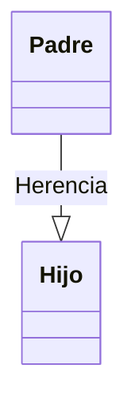
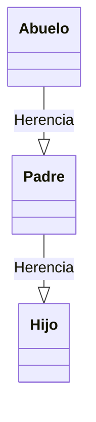
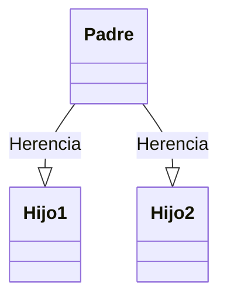
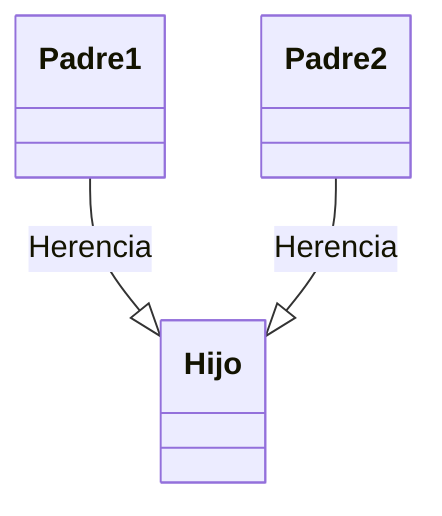
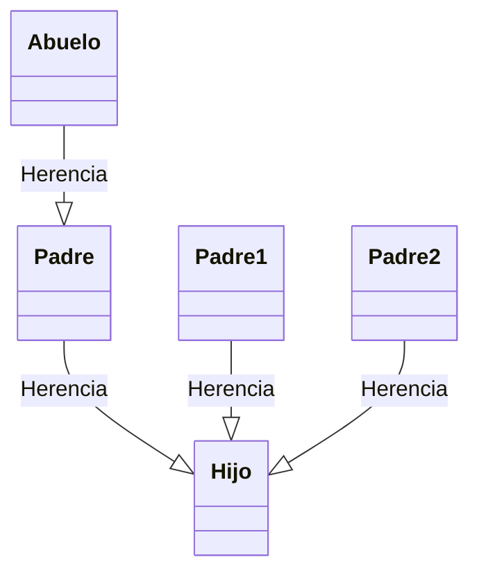
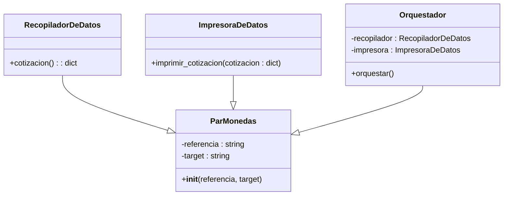

## Para el ejercicio:
-Como es posible que nos ponga el ejercicio y ya esta, recordad que hay que hacer lo siquiente:

      - 1) Npm init para crear un archivo package.json
      - 2)  Npm install *libería* que en este caso es axios
      - 3) Incluir en package.json un start con el archivo js, pero lo podeis arrancar tambien directamente con node.
      - 4) ACORDAOS DE INCLUIR UN .GITIGNORE CON LOS MODULOS DE NODE.


# Resumen UF1289 - UF1289: Diseño de elementos software con tecnologías basadas en componentes

POO

Clase
Objeto

    definiciones / diferencias

## Clase

- atributos
- variables de clase (atributo compartido)
- metodos

Herencia

- herencia Sencilla
- herencia Multinivel
- herencia Jerárquica
- herencia Múltiple
- herencia Híbrida

<!--  -->

Agregación

## Objetos

- Instanciación
    - Constructor ``__init__``
    - Destrucción ``__del__``
- Encapsulación
    - Getter
    - Setter

UML

- Diagrama de Clases
- (Pág 175)

---

Clases Abstractas

Visibilidad (information hiding)
    - publico, privado, protegido

---

- (metodos estáticos)
Componentes, modulos, interfaces
SOLID

## Teoría / test (**3 puntos**)

### 1 Programación Orientada a Objetos es un paradigma de programación que: **(Respuesta correcta: b)**

- a) ... implica la manipulación directa de hardware, como los procesadores y la memoria de acceso aleatorio.
- b) ... se basa en el concepto de objetos que pueden contener datos y código
- c) ... se centra en el uso de funciones para ejecutar tareas y manipular datos.
- d) ... se basa en la escritura de instrucciones lineales para la ejecución de código

### 2 ¿Qué es una clase en Programación Orientada a Objetos? **(Respuesta correcta: c)**

- a) Un objeto en tiempo de ejecución.
- b) Una instancia de un objeto.
- c) Una plantilla para crear objetos.
- d) Una función de un objeto.

### 3 ¿Cómo se define un atributo en una clase? **(Respuesta correcta: b)**

- a) Como una operación que un objeto puede realizar.
- b) Como una característica o propiedad que posee el objeto.
- c) Como una relación entre dos clases.
- d) Como un diagrama de la estructura del objeto.

### 4 ¿Qué es una variable de clase o atributo compartido? **(Respuesta correcta: b)**

- a) Es una variable que solo existe en un objeto particular.
- b) Es una variable que todos los objetos de una clase comparten.
- c) Es una variable que solo puede ser utilizada por los métodos de la clase.
- d) Es una variable que no puede ser heredada por las subclases.

### 5 ¿Qué es un método en una clase? **(Respuesta correcta: c)**

- a) Un atributo de la clase.
- b) Una variable de la clase.
- c) Un comportamiento o acción que puede realizar un objeto de la clase.
- d) Una relación entre dos clases.

### 6 ¿Qué es la herencia en POO? **(Respuesta correcta: c)**

- a) Es un mecanismo para compartir variables entre clases.
- b) Es un mecanismo que permite a los objetos de una clase llamar a los métodos de otra clase.
- c) Es un mecanismo que permite a las clases adquirir las propiedades y comportamientos de otras clases.
- d) Es un mecanismo que permite a los objetos de una clase acceder a los atributos de otra clase.

### 7 ¿Qué es la herencia múltiple? **(Respuesta correcta: a)**

- a) Es cuando una clase puede heredar comportamientos y propiedades de más de una clase.
- b) Es cuando una clase puede tener múltiples objetos.
- c) Es cuando una clase puede heredar de una subclase.
- d) Es cuando una clase puede tener múltiples métodos.

### 8 ¿Qué es la agregación en POO? **(Respuesta correcta: b)**

- a) Es cuando una clase depende completamente de otra clase.
- b) Es cuando una clase contiene referencias a objetos de otra clase.
- c) Es cuando una clase puede acceder a los métodos de otra clase.
- d) Es cuando una clase puede heredar de otra clase.

### 9 ¿Qué significa instanciación en POO? **(Respuesta correcta: a)**

- a) El proceso de crear un objeto de una clase.
- b) El proceso de eliminar un objeto de la memoria.
- c) El proceso de copiar un objeto a otro.
- d) El proceso de cambiar los atributos de un objeto.

### 10 ¿Qué es un constructor en POO? **(Respuesta correcta: a)**

- a) Es un método especial que se invoca automáticamente cuando se crea un objeto.
- b) Es una variable de clase.
- c) Es un tipo de herencia.
- d) Es una interfaz gráfica para la programación orientada a objetos.

### 11 ¿Qué es la encapsulación en POO? **(Respuesta correcta: b)**

- a) Es un mecanismo que permite a una clase acceder a los métodos de otra clase.
- b) Es un mecanismo para proteger el estado de un objeto.
- c) Es un mecanismo que permite a una clase contener objetos de otra clase.
- d) Es un mecanismo que permite a una clase heredar de otra clase.

### 12 ¿Qué son los métodos getter y setter en POO? **(Respuesta correcta: c)**

- a) Son métodos para inicializar y eliminar objetos.
- b) Son métodos para implementar la herencia múltiple.
- c) Son métodos para encapsular los atributos de una clase.
- d) Son métodos para implementar la agregación.

### 13 ¿Qué es UML? **(Respuesta correcta: b)**

- a) Es un lenguaje para modelar bases de datos.
- b) Es un lenguaje para modelar la estructura de una aplicación orientada a objetos.
- c) Es un lenguaje para programar en orientación a objetos.
- d) Es un lenguaje para modelar interfaces gráficas.

### 14 ¿Qué se representa en un diagrama de clases de UML? **(Respuesta correcta: b)**

- a) La secuencia de operaciones en una aplicación.
- b) La estructura de las clases y sus relaciones en una aplicación.
- c) El flujo de datos entre las clases en una aplicación.
- d) Los casos de uso de una aplicación.

### 15 ¿Cómo se representan los atributos de una clase en un diagrama de clases de UML? **(Respuesta correcta: b)**

- a) Con círculos.
- b) Con rectángulos.
- c) Con líneas.
- d) Con elipses.

### 16 ¿Que secciones se distingen en un diagrama de clases de UML? **(Respuesta correcta: d)**

- a) Nombre y atributos
- b) Atributos y métodos
- c) Nombre, atributos y métodos
- d) Todas son correctas, dependiendo del nivel de abstracción

### 17 ¿Qué significa la destrucción en la Programación Orientada a Objetos? **(Respuesta correcta: a)**

- a) Eliminar un objeto de la memoria.
- b) Eliminar una clase del código fuente.
- c) Cambiar los valores de los atributos de un objeto.
- d) Cambiar la definición de una clase.

### 18 ¿En qué consiste el principio de encapsulación? **(Respuesta correcta: b)**

- a) En hacer todos los métodos y atributos de una clase públicos.
- b) En permitir el acceso a los métodos y atributos de una clase solo a través de sus métodos.
- c) En permitir que una clase herede de varias clases.
- d) En permitir que una clase tenga solo un método.

### 19 ¿Cuál de las siguientes opciones es verdadera acerca de las variables de clase? **(Respuesta correcta: d)**

- a) Solo pueden ser accesibles desde dentro de la clase.
- b) Pueden ser accesibles desde cualquier parte del código.
- c) Solo pueden ser modificadas dentro de la clase.
- d) Todas las instancias de una clase comparten la misma copia de una variable de clase.

### 20 ¿Qué se logra con la instanciación en Programación Orientada a Objetos? **(Respuesta correcta: c)**

- a) Creación de una nueva clase.
- b) Creación de una nueva interfaz.
- c) Creación de un nuevo objeto.
- d) Creación de un nuevo método.

### 21 ¿Cuál es el propósito de un diagrama de clases en UML? **(Respuesta correcta: c)**

- a) Mostrar la interacción entre los usuarios y el sistema.
- b) Mostrar el flujo de datos a través del sistema.
- c) Mostrar la estructura y relaciones de las clases en el sistema.
- d) Mostrar la secuencia de operaciones en el sistema.


## Define las siguientes herencias

_____________________________ **Herencia única**



_____________________________ **Herencia multinivel**



_____________________________ **Herencia jerárquica**



_____________________________ **Herencia múltiple**



_____________________________ **Herencia híbrida**



## Parte práctica

Tomando como base el código proporcionado, deberás refactorizarlo aplicando los principios de la Programación Orientada a Objetos (POO). No te preocupes por la finalización del programa, éste debe ser interrumpible mediante la interrupción de teclado ```Ctrl+C```. Tampoco es necesario que dividas el programa en una clase por cada fichero. Dada la brevedad del ejercicio, dicha división sería contraproducente. Nótese que este script es tan corto que la POO no aporta valor, se pide tan solo como ejercicio académico

Deberás crear al menos cuatro clases:

- ```ParMonedas```: Esta clase servirá como clase base y contendrá los atributos comunes referencia y target, representando las dos monedas en las que estás interesado.
- ```RecopiladorDeDatos```: Esta clase heredará de ```ParMonedas``` y será responsable de obtener los datos de la API de cotización.
- ```ImpresoraDeDatos```: Esta clase, que también heredará de ```ParMonedas```, se encargará de imprimir los datos obtenidos en la pantalla.
- ```Orquestador```: Esta clase, igualmente heredando de ```ParMonedas```, coordinará las operaciones entre  las clases ```RecopiladorDeDatos``` e ```ImpresoraDeDatos```.

Sube tu solución a tu repositorio a https://github.com/elMestreAcademy/uf1289_TU_NOMBRE_DE_USUARIO_DE_GITHUB

Para comenzar el ejercicio, es recomendable partir clonando el repositorio donde debes subir el ejercicio. Recuerda hacer commits pequeños y frecuentes para registrar adecuadamente tu progreso.



### Pseudocódigo de la solución

```yaml
Clase ParMonedas:
    Constructor ParMonedas(referencia, target):
        Establecer referencia y target como atributos del objeto

Clase RecopiladorDeDatos hereda de ParMonedas:
    Método cotizacion:
        Realizar la llamada a la API para obtener la cotización de la referencia a la target
        Devolver un diccionario con la cotización

Clase ImpresoraDeDatos hereda de ParMonedas:
    Método imprimir_cotizacion(cotizacion):
        Imprimir la cotización recibida

Clase Orquestador hereda de ParMonedas:
    Constructor Orquestador(referencia, target):
        Llamar al constructor de ParMonedas con referencia y target
        Crear un objeto recopilador de la clase RecopiladorDeDatos con referencia y target
        Crear un objeto impresora de la clase ImpresoraDeDatos con referencia y target

    Método orquestar:
        Mientras Verdadero:
            Obtener cotización con el método cotizacion del objeto recopilador
            Llamar al método imprimir_cotizacion del objeto impresora pasando la cotización obtenida
            Esperar 5 segundos

Procedimiento principal:
    Crear un objeto
```

  El código de ejemplo original puede encontrarse en <https://github.com/elMestreAcademy/exchange>.
  const axios = require("axios");

async function cotizacion(moneda, base) {
  const url = `https://api.coinbase.com/v2/exchange-rates?currency=${moneda}`;

  try {
    const response = await axios.get(url);
    const valor = response.data.data.rates[base];
    console.log(`${moneda}: ${valor}`);
  } catch (error) {
    console.error(
      `Error al obtener la cotización para ${moneda} a ${base}:`,
      error.message
    );
  }
}

function startCotizaciones() {
  cotizacion("BTC", "EUR");
  cotizacion("BTC", "USD");
  cotizacion("ETH", "EUR");
  cotizacion("ETH", "USD");
  cotizacion("USD", "EUR");
  cotizacion("EUR", "USD");
}

// Ejecutar cada 5 segundos
setInterval(startCotizaciones, 5000);

//Crear una primera clase "ParMonedas"

class ParMonedas {
  constructor(referencia, target) {
    this.referencia = referencia;
    this.target = target;
  }
}


const primerPar = new ParMonedas("EUR", "USD");

primerPar.target;
primerPar.referencia;

console.log (primerPar)
